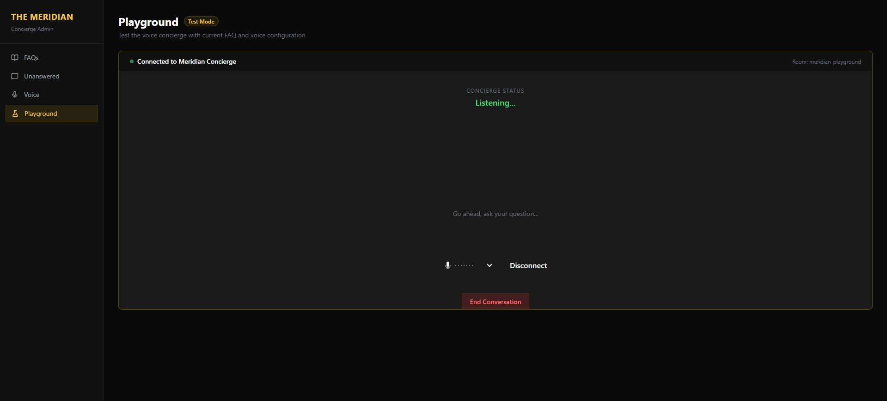

# Rocketdreams System- Software Engineer Interview Task (2026) - Slava Kagan

## -- DEMO --
[]https://bit.ly/Odysight-demo <br />
<br /> 

## -- Overview --
The Meridian Casino & Resort is a luxury destination in Las Vegas. <br />
This system is a voice-based AI concierge system for the resort that allows guests to ask questions and receive instant, spoken answers about property, amenities, and services. <br />
The system should capture questions can't answer so the team can continuously improve coverage.

## -- Goals --
Core Goals
1. Provide 24/7 instant voice support for common guest questions.
2. Capture unanswered questions for later review.
3. Maintain the luxury, personalized feel guests expect from The Meridian.
4. Provide a playground interface to test the voice concierge.

## -- How to use this service || Prerequisites --
1. Docker Desktop, Install- https://www.docker.com/products/docker-desktop/ <br />
   Run it on background.
2. GIT Install- https://git-scm.com/
3. Open Terminal from any Operation System.
4. git clone ```https://github.com/SlavaKagan/Rocketdreams-Voice-Concierge-SK-Task-2026.git```
   cd Rocketdreams-Voice-Concierge-SK-Task-2026
5. Create a root .env file with your own API keys:
   OPENAI_API_KEY=...         # OpenAI API key for embeddings + LLM
   LIVEKIT_URL=wss://...      # LiveKit WebSocket URL
   LIVEKIT_API_KEY=...        # LiveKit API key
   LIVEKIT_API_SECRET=...     # LiveKit API secret
   ELEVENLABS_API_KEY=...     # ElevenLabs API key
   ELEVEN_API_KEY=...         # ElevenLabs API key (plugin alias)
   DEEPGRAM_API_KEY=...       # Deepgram API key for STT
6. From the project root, run:
```docker compose up --build```
7. This will automatically:
   * Start PostgreSQL with pgvector
   * Start the FastAPI backend
   * Run the seed script (skips if already seeded)
   * Start the LiveKit voice agent
   * Start the React admin panel
8. Access the Site-
Open a browser and go to: ```http://localhost:3000```
The client app should be running and connected to the container.
9. At the end of use, stop the site- ```docker-compose down``` or just shutdown the terminal.

## -- Tech Stack --
**GitHub repository:** ```https://github.com/SlavaKagan/Rocketdreams-Voice-Concierge-SK-Task-2026``` <br />

**Backend (mock backend server):**  <br />
The goal is to simulate a realistic PU API quickly. <br />
Provides all required API endpoints for the features described below. <br />
**```Python + FastAPI```**- very clean API definitions, async-native, auto-generates OpenAPI docs with swagger built in. <br />

**Admin-Frontend:**  <br />
```Vite dev server in Docker``` <br />
**```React + Vite```** is data-rich, fast to develop, lightweight, and the right tool for a real-time dashboard. <br />
React's component model is a natural fit for a UI with many independent, updating pieces- live camera feeds, status badges, result tables, and alert streams all update independently. <br />
**```Typescript```** <br/>
TypeScript is a superset of JavaScript that adds static types. It compiles away at build time- the browser still runs plain JavaScript. The benefit is entirely during development. <br /> Without TypeScript, every renamed type, the frontend would silently break-undefined in the UI. <br />
TypeScript turns runtime bugs into compile-time errors <br />
**```Tailwind CSS v4```** <br/>
Utility-first CSS with zero runtime overhead. Chosen for rapid development of a consistent, dark industrial UI without introducing a heavy component library. <br/>

**Combination of the stack:**  <br />
**```Docker Compose```**- one command <br />
Operational maturity. containerization is a natural fit. Single-command startup also respects the reviewer's time. ``` "docker compose up" ``` <br />

```Frontend-Admin Panel → http://localhost:3000 ``` <br />
```Backend API → http://localhost:8000 ```<br />
```API Docs (Swagger) → http://localhost:8000/docs ``` <br />

## -- System Features--

## -- Architecture rationale --
*REST API endpoints- HTTP Methods <br />

| # | Method | Endpoint | Description |
|---|--------|----------|-------------|
| 1 | GET | /health | Health check 
| 2 | POST | /api/search | Semantic FAQ search
| 3 | GET | /api/faqs | List all FAQ items
| 4 | POST | /api/faqs | Create a new FAQ
| 5 | PUT | /api/faqs/{id} | Update a FAQ
| 6 | DELETE | /api/faqs/{id} | Delete a FAQ
| 7 | GET | /api/unanswered | List unanswered questions
| 8 | POST | /api/unanswered/{id}/convert | Convert to FAQ
| 9 | DELETE | /api/unanswered/{id}/dismiss | Dismiss a question
| 10 | GET | /api/voices | List voice options + active voice
| 11 | PUT | /api/voices/active | Set active voice
| 12 | GET | /api/playground/token | Generate LiveKit token + dispatch agent
| 13 | GET | /api/voices/{voice_id}/preview | Stream TTS audio preview

## 🎙️ Voice Options
| ID | Name | Description |
|----|------|-------------|
| 1 | James | Male, mature, warm British accent. Professional and refined. |
| 2 | Sofia | Female, friendly, subtle European accent. Welcoming and elegant. |
| 3 | Marcus | Male, American, confident and energetic. Modern and approachable. |
| 4 | Elena | Female, American, calm and reassuring. Sophisticated and clear. |
 
Voice changes take effect immediately for new conversations — no restart required.

## -- Tests Section --
```Vitest```- Test runner. <br>
```React Testing Library (RTL)```- renders components in a simulated DOM. <br>
```UserEvent```- simulates user clicks and typing. <br>

## -- Optimize the system+Future tasks --
** In order to make the system better and to improve it I thought on few things that I would done for later in production:
1. Test Reference and Automation- Frontend + Backend
   * Unit Test
   * Integration Tests
2. Add important logs through the system + Performance.
3. Security- Authentication and Authorization.
4. Rate Limiting.
5. Terraform to deploy to AWS.
6. Upload the system to server like Render- A free one

## -- Contact --
**Full Name:** Slava Kagan <br>
**Email:** <slava.kagan.ht@gmail.com> <br>
**Phone Number:** 055-3187648 <br>

## -- License --
```Rocketdreams Company Task```